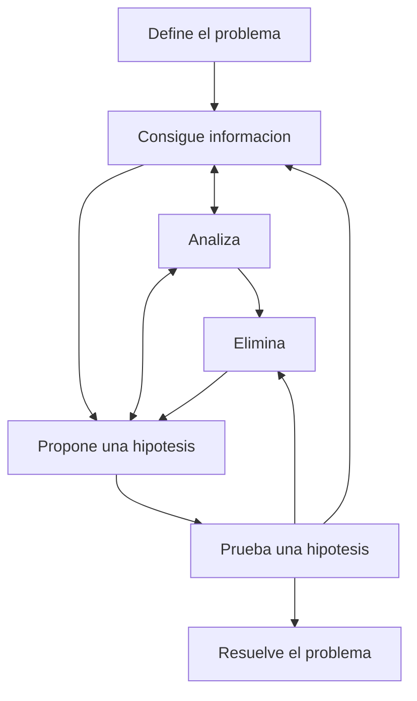

# Info
## Descripcion del ramo
- Administrar datos y ver la calidad de servicio, estandares y funcionamiento de protocolos de enrutamiento dinamico
- Reconocer e Identificar fallas empresariales para solucionarlos, IGP y EGP
- Reconocer fallas en configuraciones de Service Providers
- Otimizamos y arreglamos redes, usando metodologias y analizando el funcionamiento antes de actuar

## Analizar funcionamiento
Es importante saber que es un problema, y documentar correctamente siguiendo el patron basico
- Como encontre un error?
- Como solucione el error?
- Descripcion tecnica del error?

## Bibliografia
- Raymond Lacoste & Brad Edgeworth - CCNP Enterprise Advanced Routing ENARSI 300-410 Official Cert Guide, 2nd Edition [Official Page - Ciscopress](https://www.ciscopress.com/store/ccnp-enterprise-advanced-routing-enarsi-300-410-official-9780138217525) - [Onedrive - PDF]([Raymond Lacoste & Brad Edgeworth - CCNP Enterprise Advanced Routing ENARSI 300-410 Official Cert Guide (2024, Cisco Press).pdf](https://duoccl0-my.sharepoint.com/:b:/g/personal/ga_zunigam_duocuc_cl/EYV1JM21ON5ArO8PlO3DBG8Bv1UCRqUaZP985L3AQzbh_g?e=sZ4H9I)) [Onedrive - EPUB]([Raymond Lacoste & Brad Edgeworth - CCNP Enterprise Advanced Routing ENARSI 300-410 Official Cert Guide (2024, Cisco Press).epub](https://duoccl0-my.sharepoint.com/:u:/g/personal/ga_zunigam_duocuc_cl/Ec69UjCLcM1Hl5sdnkwUQ4gBeB7gYdhWq0s7Wjj4WnOLfQ?e=5qheAe))

## Herramientas
- [[020 - Conceptos/020.4 - Dispositivos de Red/IOU WEB|IOU WEB]]
- Cisco CML - SandBox

## Unidades
U1: 

U2: 
Tiene la prueba mas brijida de toda la carrera, EGP, IGP y Capa 2

U3:
MPLS - VPN L2 - VPN L3 - DMVPN

## Tabla idea Troubleshooting

