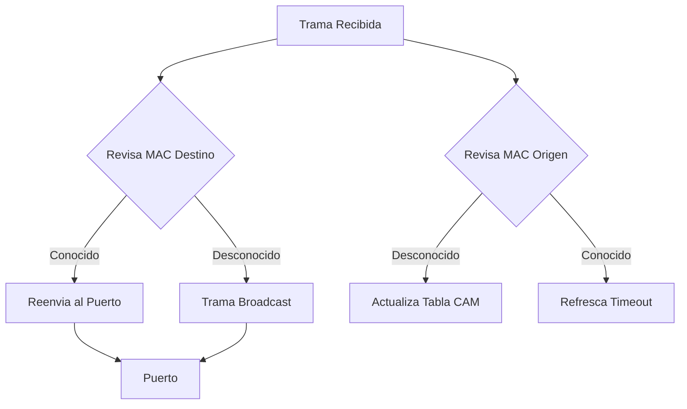

# Info
Funciona en [[020 - Conceptos/020.3 - Fundamentos/Modelo OSI#Capa 2|Capa 2]], crea una relacion de confianza entre una [[020 - Conceptos/020.3 - Fundamentos/Interfaz|Interfaz]] y [[020 - Conceptos/020.3 - Fundamentos/MAC|MAC]] en la tabla [[020 - Conceptos/020.4 - Dispositivos de Red/IOU WEB#CAM|CAM]], enviando mensajes entre dispositivos a travez del "Data Plane"

## Metodo Aprendizaje
- MAC Origen
	- Si no existe: Agrega a la tabla [[020 - Conceptos/020.4 - Dispositivos de Red/IOU WEB#CAM|CAM]] por 5 minutos
	- Si ya existe: Reestablece el timeout de 5 minutos
- MAC Destino
	- Si no existe: Envia un mensaje de Broadcast por sus interfaces a travez de la Sub-Red
	- Si ya existe: reenvia el trafico por la interfaz correspondiente



# Visualizacion
`show interfaces [int S/S/P] switchport` -> Revisar configuracion Puerto
`show interface status` -> Estado interfaz condensada y simplificada

# Troubleshooting
> Enfoques para utilizar: De abajo hacia arriba - Comparacion
1. Interfaz Encendida
	- `show ip int brief`: Resumen interfaces
	- `show int status`: Velocidad, estado y err-disable
	- `show int [int S/S/P]`: detalles sobre interfaz
3. Asignacion de [[010 - Protocolos/010.2 - Switching/VLAN|VLAN]] (Troncales y Acceso)
	- `show vlan brief`: Creacion de vlans | `show vlan`
	- `show vlan id [vlan-id]`
	- `show interfaces trunk`: VLANs permitidas en enlaces troncales
4. [[010 - Protocolos/010.2 - Switching/Etherchannel|Etherchannel]]
	1. General
		- `show etherchannel summary`: Resumen y detalle grupos
		- `show etherchannel [po-number] detail`
		- `sh etherchannel [po-number] detail | s Mode`
		- `show etherchannel detail`: Detalle sobre Negociacion de grupo
		- `show etherchannel port-channel`: VLAN asignadas
	2. LACP
		- `show lacp internal`: Estado LACP, Ver modo Pasivo / Activo
		- `show lacp neighbor`: Vecinos LACP
	3. PAgP
		- `show pagp internal`: Estado PAgP, timers y flags
		- `show pagp neighbor`: Vecinos PAgP
5. [[010 - Protocolos/010.2 - Switching/spanning-tree/802.1D (STP)|802.1D (STP)]] o [[010 - Protocolos/010.2 - Switching/spanning-tree/802.1W (RSTP)|802.1W (RSTP)]]
- Problemas:
	- Estado STP
		- `sh spa`
		- `sh spa sum`
		- `sh spa vlan [vlan-id]`
		- `sh spa root`: Switch Raiz para cada VLAN
		- `sh spa bri`: Prioridades y costo del switch
		- `sh spa bri det`: Ver info sobre el [[010 - Protocolos/010.2 - Switching/spanning-tree/Root Bridge|Root Bridge]] y mas info
	- [[010 - Protocolos/010.2 - Switching/spanning-tree/Tipos de Puerto|Tipos de Puerto]] STP
		- `sh spa act`
		- `sh spa inc`
		- `sh spa int [int S/S/P]`
		- `sh spa mst int [int S/S/P]`
	- [[010 - Protocolos/010.2 - Switching/spanning-tree/Mecanismos de estabilizacion|Mecanismos de estabilizacion]] STP y [[010 - Protocolos/010.2 - Switching/Seguridad de Puerto|Seguridad de Puerto]] 
		- `show int status`
		- `show por int [int S/S/P]`
6. [[010 - Protocolos/010.2 - Switching/spanning-tree/802.1S (MSTP)|802.1S (MSTP)]]
- Problemas: 
	- Estado MSTP
		- `sh spa`
		- `sh spa mst conf`: Configuracion de MST
		- `sh spa mst [instance-number]`
		- `sh spa mst interface [int S/S/P]`

# Extra
Usa Chips ASIC: Circuitos integrados especificos de la aplicacion, de alli su rapidez
## Metodo Reenvio
- Switching Store-and-Forward (Almacenamiento y reenvio) `[Defecto en Cisco]`: Recibe toda la trama del trafico, la verifica y la reenvia despues de determinar la MAC de destino.
	- Comprobacion de Errores: Comprueba errores CRC(**C**yclic **R**edundancy **C**heck) en la FCS(**F**rame **C**heck **S**equence o "Secuencia de Comprobacion de Cuadros"). Se descartan tramas malas.
	- Almacenamiento en Bufer: Mientras comprueba el FCS se almacenara la trama en bufer, esto permite regular las velocidades de los puertos y evitar cuellos de botella.
	- Metodo "Frag(Fragment) Free", comprueba el destino y asegura que sea de almenos 64 Bytes, esto evita los runts(generalmente tramas erroneas, errores o colisiones)
- Switching Cut-Through (Corte): Reenvia la trama inmediatamente despues de determinar
	- Latencia muy pequeña (~10 µs)
	- No comprueba FCS, puede propagar errores, lo que puede provocar problemas de Bandwidth
	- No es compatible con puertos de entrada/salida a diferentes velocidades
### Configuracion Experimental
```
enable
show interfaces switching
config t
int [int S/S/P]
switching-mode cut-through
```
## Estructura Frame
- Frame Header
	- Preamble (8B)
	- Destination MAC Address (6B)
	- Source MAC Address (6B)
	- Type (2B)
	- FCS Checksum (CRC) (4B)

## Colisiones
Las colisiones son 
Aunque la mayoria de dispositivos negocian el estado y la velocidad
- Full
	- No hay dominios de colision
	- Reduce la congestion
- Half
	- Las colisiones son posibles
	- Contencion por el ancho de banda
