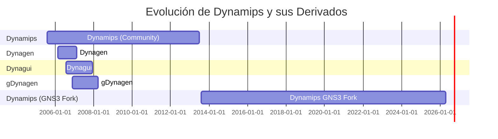
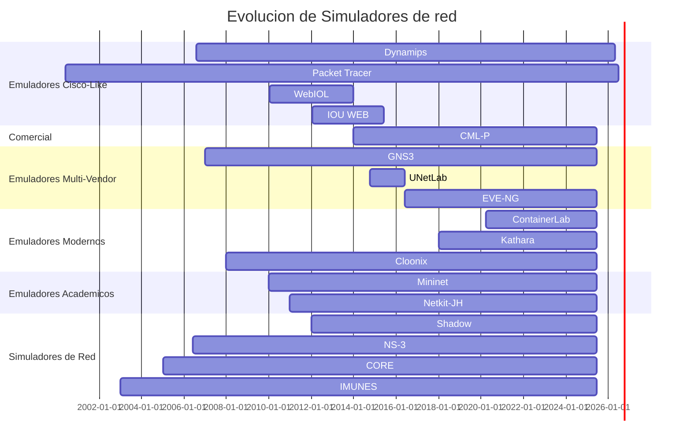

# Info
> [!TIP] Lectura Recomendada
> - [Habr MaxxxZ Blog - Imitacion de Cisco, Identica al original (Ru)](https://habr.com/ru/articles/494504/)
> - [Nil Uniza SK Blog - Network Simulation Software List](https://nil.uniza.sk/en/network-simulation-virtualization-software-list/)

## Cisco-Like

Estos son los primeros que se crearon y los que van evolucionando por una linea muy marcada por el uso de imagenes IOS tradicionales, extension de funcionalidades y laboratorios estilo CCNA/CCNP.

Tambien que falta explicar que es un IOS, IOU, un IOL, los tipos de nombre

### Dynamips

> [!TIP] Lectura Recomendada
> - [Github GNS3/dynamips](https://github.com/GNS3/dynamips)
> - [IPflow Blog via Internet Archive Wayback Machine](https://web.archive.org/web/20120427212815/http://www.ipflow.utc.fr/blog/?cat=1)
> - [Dynagen Blog via Internet Archive Wayback Machine](https://web.archive.org/web/20151127223804/https://www.dynagen.org/)
> - [IPflow Blog - Cisco 7200 Simulator via Internet Archive Wayback Machine](https://web.archive.org/web/20140314073202/www.ipflow.utc.fr/index.php/Cisco_7200_Simulator)
> - [Dynagen Docs - Tutorial via Internet Archive Wayback Machine](https://web.archive.org/web/20120212144911/http://dynagen.org/tutorial.htm)
> - [Dyna-Gen Sourceforge](https://web.archive.org/web/20070226133132/http://dyna-gen.sourceforge.net/)
> - [Dynagui Sourceforge via Internet Archive Wayback Machine](https://web.archive.org/web/20140714192058/http://dynagui.sourceforge.net/)

Es el tio abuelo de la emulacion, nacio en Agosto de 2005 por Fabien Devaux, Christophe Fillot y MtvE para emular routers cisco 1700, 2600, 3600, 3700 y 7200. Fue pionero en su tiempo, pero han evolucionado a otras tecnologias, su ultima version fue la 0.2.8-community lanzada el 4 de Julio del 2013

El 20 de febrero de 2006, Greg Anuzelli creo Dynagen, un front-end escrito en Python para facilitar el uso de Dynamips mediante archivos `.ini`, y la ultima lanzada fue del 18 de febrero de 2007

En 22 de Julio de 2006, Yannick Le Teigner creo Dynagui, el cual esta basado en la libreria Dynagen para comunicarse con dynamips, su objetivo es aplicar distintos parches y configurar una GUI, su ultima version lanzada fue el 13 de Diciembre del 2007

El 19 de Noviembre de 2006, Thomas Pani lanzo gDynagen, otra herramienta que funcionaba sobre Dynagen, los parches fueron aplicados al upstream, este proyecto tuvo su ultima version el 27 de marzo de 2008

Luego el 30 de Julio de 2013, con el lanzamiento de la version 0.2.9 de Dinamips se creo un fork a cargo de GNS3 disponible en Github, el cual continua desarrollandose y arreglando errores, la ultima version es la 0.2.24 del 19 de abril de 2026, aunque realmente no se recomienda usarlo.



### Cisco Packet Tracer

> [!TIP] Lectura Recomendada
> - [Netacad Learning Resources - Download Packet Tracer](https://www.netacad.com/es/resources/lab-downloads)
> - [Packettracer Networks Blog - New Features Packet Tracer 9.0.0 Beta](https://www.packettracernetwork.com/features/packet-tracer-9-new-features.html)
> - [Sysnettech Blog - What is Cisco Packet Tracer](https://www.sysnettechsolutions.com/en/what-is-cisco-packet-tracer-software/)
> - [Internet Archive - CO-Action - Development of a Simulated Internet for Education](https://web.archive.org/web/20170816061022/http://journals.co-action.net/index.php/rlt/article/view/7777)
> - https://tutorials.ptnetacad.net/tutorials80.htm
> - https://tutorials.ptnetacad.net/help/default/index.htm

> [!quote]
> Todos los modelos estan equivocados, pero algunos son utiles
> 
> — George Box

AD: La fuente soy yo, le envie un correo a "Dennis Charles Frezzo" y me respondio. Mas informacion en [[#Preguntas al creador de PT]]

Cisco Packet Tracer es una herramienta de simulacion oficial desarrollada internamente por Cisco, orientada exclusivamente a entornos educativos dentro del programa NetAcad (**Net**working **Acad**emy). No es un emulador, ni siquiera utiliza Cisco IOS. En cambio, su equipo modelo "hacia atras" a partir de un IOS real hasta alcanzar un grado de fidelidad tanto del sistema operativo como de los protocolos, construyendo una plataforma para topologias ilustrativas con comportamientos simplificados orientados a laboratorios virtuales de redes, IoT, ciberseguridad y certificaciones como CCNA o CCNP.

El desarrollo comenzo en el año 2000, nacido del cansancio de explicar el funcionamiento completo de dispositivos de red en una pizarra. La primera version fue una aplicacion JavaScript de aproximadamente 3.000 lineas, cuyo unico proposito era visualizar las transformaciones de direcciones en Capa 2 (MAC) y Capa 3 (IP) dentro de una LAN interconectada. Los primeros programadores fueron **Michael Wang** y **Mark Chen**, quienes fueron fundamentales en todo el diseño y desarrollo principal del software. Hoy el proyecto ronda los 2.000.000 de lineas de codigo en C++

Como herramienta, Packet Tracer nunca fue pensada para reemplazar la experiencia practica con equipamiento real ni herramientas mas sofisticadas de diseño y simulacion de redes, sino para actuar como unas "ruedas de entrenamiento", un andamiaje educativo que ayuda a los estudiantes a construir modelos mentales del funcionamiento de las redes.

En cuanto a su historia de distribucion, estuvo como desarrollo interno entre 2000 y 2003, hasta el lanzamiento de la version 3.0 ese mismo año, dio el salto de herramienta de visualizacion a simulacion. Entre 2003 y 2007 fue usada por instructores dentro de NetAcad, periodo que tambien incluyo la version 4.0 Preview Edition. En 2008, con la version 5.0, introdujo soporte para IPv6 y multi-usuario. En 2015, la version 7.x amplio aun mas el acceso, permitiendo descargarla con solo registrarse en el portal sin necesidad de estar inscrito en algun curso. Desde la version 8 en adelante, Cisco integro soporte para dispositivos IoT, programacion con Python y microcontroladores como parte de las iniciativas STEM. Al momento de escribir, la version es la 9.0.0

### WebIOU

> [!TIP] Lecturas Recomendadas
>  - [Andrea Dainese - UNL: The Story # Previously on WebIOL/iou-web](https://www.adainese.it/blog/2019/01/01/unified-networking-lab-unetlab-the-story/#previously-on-webioliou-web)
>  - [WebIOU on Linux (x86) as VMware Virtual Machine (aka "WebIOL")](https://www.scribd.com/presentation/277094101/WebIOU-on-Linux)

Hay que remontarse al 2010, Cisco trabaja en una herramienta interna llamada "WebIOU on Linux (x64)" a.k.a WebIOL, desarrollada en Perl para sus propios ingenieros, utilizada en el programa Cisco 360. Al no estar accesible al publico y contar con licencia cerrada, surgio la necesidad de una alternativa.


Es un proyecto interno de cisco desarrollado en Perl y fue parte del programa "Cisco 360" para emular IOS en Linux (x86) lo que luego seria IOL

Hay una charla de "Mike Timm" y "Kaoru Yamashita" el 14 de febrero de 2011

mtimm@cisco.com
kaoru,kyamashi@cisco.com

Acceder
- Daily: webiou/webiou
- Admin: root/cisco123

Links
- https://wwwin-deployment.cisco.com/wiki/bin/view/IOU/LicenseKeys
- https://wwwin-deployment.cisco.com/wiki/bin/view/IOU/WebIOULinuxPort
- https://wwwin-people.cisco.com/kaoru/WebIOL/

Release History
- 0.1 - Jan 6, 2010
	- BLABLABLA
- 0.2 - Jan 17, 2010
	- Maintenance Release. Most of labs will start. Multi-user might work
- 0.21 - Jan 18, 2010
	- maintenance Release. Added adventerprisek9 IOL image
- 0.3 by Mike Timm - Aug 9, 2010
	- Add L2IOL image and sample lab template
	- Modified script to support L2IOL image
- 0.4 by Mike Timm - Aug 12, 2010
	- Add Cisco360 labs
- 0.5 - Aug 15, 2010
	- Reduce package size (1.3GB -> 550MB). Switch to Fedora 13
- 0.6 - Sep 3, 2010
	- Web-based Licese Key setup by Mike Timm
	- Added adventerprisek9 Pagent Image


Mi sospecha es que se convirtio en algun punto en VIRL, pero no esta confirmado por absolutamente nadie

### IOU WEB

> [!TIP] Lecturas recomendadas sobre IOU WEB
> - [Youtube - Nicolas Contador - IOU WEB](https://youtu.be/Wo_W6hcBXy0?si=GzVKPTpF-42eVTHx)
> - [My Howtos and Projects Blog - Cisco IOU: Installing and Running (Lite)](https://myhowtosandprojects.blogspot.com/2013/08/installing-and-running-iou-checking_10.html)
> - [Evilrouters - Cisco IOU FAQ](https://web.archive.org/web/20190310083921/http://evilrouters.net/2011/01/18/cisco-iou-faq/)
> - [Network Haven Blog - Cisco IOU FAQ mirror](https://networkhaven.blogspot.com/2014/02/cisco-iou.html)
> 	- [Nabromov - IOU Faq Mirror](https://nabromov.blogspot.com/2011/01/ios-on-unix-iou.html)
> - [VMgeeks Blog - Deploying Cisco IOU web interface on Vsphere](https://vmgeeks.wordpress.com/2012/07/21/deploying-cisco-iou-web-interface-on-vmware-esxi/)
> - [Daniel Kovacs Blog - Cisco IOU with web interface](https://kovacsdaniel.blogspot.com/2015/02/cisco-iou-with-web-interface.html)
> - [TΩИΨ Blog - How to install GlibC and libGCC 32 bits on 64 bits OS](https://www.lixu.ca/2017/06/redhat-how-to-install-glibc-and-libgcc.html)
> - [Evil Routers Blog - Defeating Cisco IOU License Protection via Internet Archive](https://web.archive.org/web/20180323124250/http://evilrouters.net/2011/01/09/defeating-cisco-iou%E2%80%99s-license-protection/)
> - [FreeCCNALabs Blog - Cisco IOU Licencing via Internet Archive Wayback Machine](https://web.archive.org/web/20160302020104/http://freeccnalabs.com/cisco-ios-on-unix-licensing/)
> - [Ciscoiseasy - IOU Forbidden Fruit](https://ciscoiseasy.blogspot.com/2014/07/iou-forbidden-fruit.html)
> - [Samuraj - Cisco IOS 1 - Introduction Show Command](https://www.samuraj-cz.com/en/article/cisco-ios-1-introduction-show-command/)
> - ThomasLow Blogs
> 	- [Cisco IOU Installation Steps on VMware](https://thomaslowblog.wordpress.com/2015/08/18/cisco-iou-installation-steps-on-vmware/)
> 	- [Using Cisco IOU](https://thomaslowblog.wordpress.com/2015/08/18/using-cisco-iou/)
> - Brezular Blogs
> 	- [Cisco L3 and L2 IOUs running on Fedora Linux](https://brezular.com/2011/04/30/iou-on-fedora-linux/)
> 	- [Creating a Cisco Switch using IOLl2 loaded on Linux Core QEMU Image](https://brezular.com/2011/11/01/cisco-network-device-based-on-iou-installed-on-core-linux/)
> 	- [How to Connect IOU to a Real Cisco Gear Using iou2net.pl](https://brezular.com/2013/10/09/how-to-connect-iou-to-a-real-cisco-gear-using-iou2net-pl/)
> 	- [How to Connect IOU to Real Cisco Gear Using IOU Live - int2netio](https://brezular.com/2013/10/15/how-to-connect-iou-to-a-real-cisco-gear-using-iou-live-int2netio/)
> 	- [Using IOUl2 Loaded on CentOS Qemu](https://brezular.com/2011/10/23/creating-a-cisco-switch-using-ioul2-loaded-on-centos-qemu-image/)

> [!TIP] Brezular Blog - Building Linux L3 switch/router on x86 Series
> - [Part 1 - Introduction](https://brezular.com/2011/09/01/building-linux-l3-switchrouter-on-x86-part1-introduction/)
> - [Part 2 - CentOS 6.0 Instalation](https://brezular.com/2011/09/01/building-linux-l3-switchrouter-on-x86-part2-centos-6-0-installation/)
> - [Part 3 - Wireless Access Point Installation and Configuration](https://brezular.com/2011/09/01/building-linux-l3-switchrouter-on-x86-part3-wireless-access-point-installation-and-configuration/)
> - [Part 4 - OpenvSwitch Installation and Configuration](https://brezular.com/2011/09/03/building-linux-l3-switchrouter-on-x86-part4-openvswitch-installation-and-configuration/)
> - [Part 5 - Connecting Box to the internet - PPPoE Configuration](https://brezular.com/2011/09/03/building-linux-l3-switchrouter-on-x86-part5-connecting-box-to-the-internet-pppoe-configuration/)
> - [Part 6 - Connecting Box to the internet - NAT and Firewall Configuration](https://brezular.com/2011/09/11/building-linux-l3-switchrouter-on-x8-part6-connecting-box-to-the-internet-nat-and-firewall-configuration/)
> - [Part 7 - DDNS and NTP Installation and Configuration](https://brezular.com/2011/09/11/building-linux-l3-switchrouter-on-x8-part7-ddns-and-ntp-installation-and-configuration/)
> - [Part 8 - DNS Cache Server Installation and Configuration](https://brezular.com/2011/09/11/building-linux-l3-switchrouter-on-x86-part8-dns-cache-server-installation-and-configuration/)
> - [Part 9 - DHCP and Samba server Instalattion and Configuration](https://brezular.com/2011/09/11/building-linux-l3-switchrouter-on-x86-part9-dhcp-and-samba-server-installation-and-configuration/)

> [!TIP] Andrea Patreon
> - https://www.patreon.com/adainese/posts/iou-web-108583640?collection=659057
> - https://www.patreon.com/adainese/posts/unetlab-of-iou-108584286?collection=659057
> - https://www.patreon.com/adainese/posts/network-are-must-108476856?collection=659057

MISH; SOY FAN DE ANDREA DAINESE PARECE

El 23 de enero de 2012, [Andrea Dainese](https://www.adainese.it/), conocido en Github como [dainok](https://github.com/dainok), lanzo IOU-WEB, un emulador escrito en PHP que aprovechaba las imagenes IOL (IOS on Linux). Esta solucion destaco por ser portable, estable y en muchos casos, mas agil que Dynamips. Durante sus primeros años IOU-WEB acumulo centenares de usuarios, pero con el tiempo Andrea decidio pausar su mantenimiento y su ultima version (1.2.2-24) data del 28 de mayo de 2015 y se encuentra archivado en su repositorio en Github [dainok/iou-web](https://github.com/dainok/iou-web)

Durante ese tiempo existio un sitio web llamado "Evil Routers" a.k.a "routereflector" que recopilaba informacion del funcionamiento, algunas paginas se pueden recuperar con ayuda de Wayback Machine son: La [pagina de inicio](https://web.archive.org/web/20190617180122/http://evilrouters.net/), o el [FAQ de Cisco IOU](https://web.archive.org/web/20180207132822/http://evilrouters.net/2011/01/18/cisco-iou-faq/).

> [!NOTE] Nota sobre IOU WEB
> He trabajado un buen tiempo en maquinas virtuales con [[020 - Conceptos/020.4 - Dispositivos de Red/IOU WEB|IOU WEB]], solucionando un par de problemas importantes, puedes ver mi esfuerzo en distintos Write UPS
> - [[300 - Conocimiento/Write-Ups/IOU-WEB/IOU WEB - 32 Bits CentOS 6 (Legacy)|IOU WEB - 32 Bits CentOS 6 (Legacy)]]: La implementacion que me entregaron, una maquina de 32 bits con CentOS 6, es la que mejor funciona
> - [[300 - Conocimiento/Write-Ups/IOU-WEB/IOU WEB - 64 Bits CentOS 7 (Legacy)|IOU WEB - 64 Bits CentOS 7 (Legacy)]]: Intente mejorar el funcionamiento para aceptar maquinas de 64 bits como los routers XE
> - [[300 - Conocimiento/Write-Ups/IOU-WEB/IOU WEB - Config Win 10-11|IOU WEB - Config Win 10-11]]: Set de configuraciones para Windows
> - [[300 - Conocimiento/Write-Ups/IOU-WEB/IOU WEB - Intentos Fallidos|IOU WEB - Intentos Fallidos]]: Coleccion de ideas que no llegaron a buen puerto...

Se redistribuyeron 2 grandes version, la version de CentOS 6.2 (WEBUI) y la version de Debian (TTY)

Yo nunca probe la version de Debian, sino la de CentOS y la que me encargue de mejorar


## Comunitarios
### GNS3

> [!TIP] Lectura Recomendada
> - [GNS3 Docs - Getting Started](https://docs.gns3.com/docs/)
> - [GNS3 - Marketplace](https://gns3.com/marketplace/featured)
> - [GNS3 - Teachable Academy](https://gns3.teachable.com/)
> - [Github GNS3/ubridge](https://github.com/GNS3/ubridge)
> - VPCS
> 	- [Github GNS3/vpcs](https://github.com/GNS3/vpcs)
> 	- [Freecode VPCS Wiki via Internet Archive Wayback Machine](https://web.archive.org/web/20120622133308/http://www.freecode.com.cn/doku.php?id=wiki:vpcs)
> - [Rednectar Blog - A Little GNS3 History](https://rednectar.net/gns3-workbench/a-little-gns3-history/)
> - [Tolgabagci Blog - What is GNS3?](https://www.tolgabagci.com/en/what-is-gns3/)

**G**raphical **N**etwork **S**imulator 3, nacio en 2007 como una interfaz grafica para facilitar el uso de Dynamips, que era bastante famoso en esa epoca. Su creador, Jeremy Grossman, buscaba una forma mas accesible y visual de diseñar laboratorios sin tener que escribir manualmente cada conexion. Desde entonces, ha evolucionado sin parar, hoy soporta multiples tecnologias como QEMU/KVM, Docker, IOU, VMs, e imagenes Multivendor.

Ademas cuenta con una comunidad activa basado en el Open Source, un marketplace de dispositivos preconfigurados y una academia con cursos (Gratis y Pagados) para quienes esten empezando o quieren profundizar en automatizacion.

Como extra, mantienen forks de programas viejos integrados a su stack, algunos ejemplos son Dynamips (Descrito mas arriba), VPCS y ubridge (antes iouyap).

### UNL

> [!TIP] Lecturas recomendadas
> - [Dainok - UnetLab: The Story](https://www.adainese.it/blog/2019/01/01/unified-networking-lab-unetlab-the-story/)
> - [Dainok - Speculating About UnetLabv3](https://www.adainese.it/blog/2022/04/20/speculating-about-unetlabv3/)
> - [Dainok - Unetlabv3 Development Series](https://www.adainese.it/blog/2024/07/22/unetlab-v3-development-series/)
> - [Conproly - Networking lab Setup with UnetLab](https://www.conproly.com/blogs/20161129-networking-lab-setup-with-unetlab/)
> - [Packet Pusher Priority Queue Podcast - PQ Show 61: The UnetLab Project via Internet Archive Wayback Machine](https://web.archive.org/web/20151029024028/http://packetpushers.net/podcast/podcasts/pq-show-61-unetlab-project/)


Dainok, necesitaba no solo ejecutar imagenes IOL, sino tambien emuladores basados en Dynamips y QEMU/KVM, asi que en octubre de 2014, inicia el desarrollo de "UnetLab", el cual su fuente esta disponible en Github [dainok/unetlab](https://github.com/dainok/unetlab), junto a otros colaboradores como:
- Uldis Dzerkals
- Alain Degreffe
- Michael Yandulov
- Ruslan Foutorianski
- Dragoş Vasiloi

Este proyecto amplio el soporte a multiples vendors. A inicios de 2015, Dainok anuncio que se alejaba del proyecto por falta de tiempo, dejando la evolucion a manos de la comunidad. Aunque hubieron luego planes para crear UnetLab v2, no llego a buen puerto y la rama quedo discontinuada en algun punto de 2016.


### EVE-NG
Emulated Virtual Environment Next Generation

EVE-NG es una solucion que unifica diversas tecnologias y proyectos en una plataforma robusta y flexible. Su desarrollo se basa en varios proyectos previos como Cisco WebIOL, IOU-WEB y UnetLab.

En 2016, se crea "EVE-NG LTD", con la cual fue trabajando internamente, El 5 de enero de 2017, Uldis Dzerkalis y un equipo presentaron al publico [EVE-NG](https://www.eve-ng.net/), el cual es un fork del trabajo hecho en UnetLab que continua en desarrollo.

### OMNeT++

https://github.com/omnetpp/omnetpp
https://omnetpp.org/

### NOVA-VE

Otro simulador de red mas, pero este nace desde 0 como una implementacion limpia

Fuente: https://github.com/fahadysf/nova-ve
Docs: https://docs.nova-ve.com/

Se debe instalar un VM de [Ubuntu Server 26.04 LTS](https://ubuntu.com/download/server), luego con un sudo script puedes instalar


## Comerciales

### CML-P

> [!TIP] Lectura Recomendada
> - [Cisco Devnet Docs - Introduction to Cisco Modeling Labs v2.8](https://developer.cisco.com/docs/modeling-labs/2-8/)
> - [Cisco Devnet Docs - CML 2.8 Release Notes Changelog](https://developer.cisco.com/docs/modeling-labs/2-8/cml-release-notes/#summary-of-changes)
> - [Cisco DevNet Docs - CML-Free 2.8](https://developer.cisco.com/docs/modeling-labs/2-8/cml-free/)
> 	- [Cisco ID Login](https://id.cisco.com/)
> 	- [Cisco MKTO - Register to CML-Free](https://mkto.cisco.com/cml-free.html)
> 	- [Cisco - Software Download](https://software.cisco.com/download/home/)
> 	- [Cisco Devnet Docs - CML Installation Guide](https://developer.cisco.com/docs/modeling-labs/cml-installation-guide/)
> - [Cisco Learning Network Store - CML Personal License](https://learningnetworkstore.cisco.com/cisco-modeling-labs-personal/cisco-modeling-labs-personal/CML-PERSONAL.html)
> - [Packet Thrower Blog - Using VIRL](https://the-packet-thrower.com/using-virl/)
> - [David Bombal Blog - Cisco CML-P Series (Part 1)](https://ccnax.com/cisco-cml-p-virl-2-download-install-and-configure-part-1/)

**C**isco **M**odeling **L**ab - **P**ersonal, es una plataforma oficial de Cisco con un costo de $200USD/año, este nacio en 2014 bajo el nombre de "VIRL" (**V**irtual **I**nternet **R**outing **L**ab), luego fue rebautizado como "CML" para uso corporativo, y en 2020, el trabajo en VIRL² paso a llamarse CML-P o CML².

Permite simular topologias con imagenes reales de IOSv, IOS-XRv, NX-OS, entre otros mas directamente de la fuente de Cisco

Cisco lanzo una propuesta llamad CML-Free en su version 2.8.0 del 21 de noviembre de 2024 de CML², a la cual debes registrarte en Cisco MKTO.

Entre los limites de esta version esta
- Solo permite 5 nodos simultaneamente en un laboratorio (Los conectores externos y Switches tontos no cuentan como nodos)
- Usa un mayor nivel de telemetria anonima
- Permite descargar imagenes de Cisco directamente pero solo del tier FREE

### Boson Cisco Netsim
> [!TIP] Lectura Recomendada
> - [Boson - Cisco Network Simulator](https://www.boson.com/netsim-cisco-network-simulator)

Un simulador cerrado de pago que permite emular laboratorios de Cisco enfocado en sus certificaciones CCNA, CCNP y CCIE. No permite utilizar imagenes externas y es sponsor de varios canales de redes, lo dejo aqui para que lo reconoscan, yo que ustedes, no me dejaria engañar

### Netsim

Bueno, este lo he escuchado, investigando, peleaba con Packet Tracer


## Enfoque Academico o Investigacion

### Cloonix

> [!TIP] Lectura Recomendada
> - http://clownix.net/
> - https://github.com/clownix/cloonix

### CORE
> [!TIP] Lectura Recomendada
> - https://github.com/coreemu/core

**Co**mmon **R**esearch **E**mulator

### Imunes
> [!TIP] Lectura Recomendada
> - https://www.imunes.net/


### Mini-Net
> [!TIP] Lectura Recomendada
> - http://mininet.org/

### Mini-Net Wifi
> [!TIP] Lectura Recomendada
> - https://mininet-wifi.github.io/

### NS-3
> [!TIP] Lectura Recomendada
> - https://www.nsnam.org/

### Shadow
> [!TIP] Lectura Recomendada
> - https://shadow.github.io/
> - https://shadow.github.io/docs/guide/

### Netkit JH
> [!TIP] Lectura Recomendada
> - https://netkit-jh.github.io/

Fork activo y mantenido de Netkit-ng y Netkit, se enfoca en laboratorios ligeros de red en entornos Linux. Se basa en User Mode Linux (UML) y tiene una fisolofia muy academica: terminal, scripting y ligereza. Ideal para contextos universitarios o cursos introductorios

## Basado en contenedores
Un gran WIP :P

### ContainerLab
> [!TIP] Lectura Recomendada
> - https://containerlab.dev/

### Kathara
> [!TIP] Lectura Recomendada
> - https://www.kathara.org/


# Evolucion de Proyectos

Durante mas de dos decadas, han existido intentos para emular o virtualizar entornos de red complejos sin necesidad de hardware fisico. Aunque muchos proyectos han quedado obsoletos o abandonados, otros todavia persisten hasta el dia de hoy (10-Junio-2025)

Aunque si tienes dinero de sobra y luz para gastar, podrias hasta comprar el equipamiento de red que necesites, es el mas entretenido pero mas costoso de realizar y no es muy dinamico para intercambiar dispositivos, pero es una opcion




# Extras
## Gracias
- [Github - hegdepavankumar](https://github.com/hegdepavankumar) | [Buy me a Coffee](https://buymeacoffee.com/hegdepavankumar)
- Andrea Dainese - [Linkedin](https://www.linkedin.com/in/adainese/) | [Github](https://github.com/dainok) | [Blog](https://www.adainese.it/) | [Patreon](https://www.patreon.com/adainese): Por la creacion de IOU-WEB, UnetLab y EVE-NG
	- [Andrea Dainese Blog - UnetLab: The Story](https://www.adainese.it/blog/2019/01/01/unified-networking-lab-unetlab-the-story/)
	- [Andrea Dainese Blog - Speculating About UnetLab](https://www.adainese.it/blog/2022/04/20/speculating-about-unetlabv3/)
- GNS3
	- Jeremy Grossman (Co-founder) - [Linkedin](https://www.linkedin.com/in/jeremy-g-8b59463/)
- EVE-NG
	- Uldis Dzerkals (CEO) - [Linkedin](https://www.linkedin.com/in/uldisdzerkals/)
	- Alain Degreffe (CTO) - [Linkedin](https://www.linkedin.com/in/alaindegreffe/)
- Documentos
	- Ninguno por ahora
- Foros
	- [EVE-NG Forums](https://www.eve-ng.net/forum/)
- Profesores
	- Dedicado a quienes me mostraron que las clases no terminan al final del bloque
	- A **Nicolás Contador** por sembrar curiosidad técnica cuando recién empezaba a entender IOU.  
	- A **Víctor Araneda**, por hacer del pizarrón una extensión de su memoria y del aula un lugar para pensar más allá.
	- A **Juan Pablo Calderon** por acompañarme como uno mas en todas las ideas que se me ocurren.
	- A todos los profes que en vez de bajarle el volumen a un estudiante curioso, lo invitaron a soñar más alto.

## Preguntas al creador de PT

Okey, le envie un correo preguntando sobre PT, que esta integramente aqui
```
Dear Dr. Frezzo,  
  
My name is [Gabo], Network Engineer from Chile, and I am currently writing a research article (in Spanish) on the history of network emulators and simulators, covering tools such as Dynamips, GNS3, EVE-NG, and Cisco Packet Tracer, among others.  

From public sources, I have been able to piece together the institutional context fairly well: NetAcad was founded in 1996 by George Ward, the first courses were offered in 1997, and you joined Cisco in 1998 to lead what became the Simulation, Game, and Mobile Engineering organization. From there, the earliest documented trace I can find is an instructor FAQ for the launch of Packet Tracer 3.0 in 2003, followed by the 4.0 Preview Edition distributed through Academy forums in the 2006/2007 academic year, and from PT 5.0 onwards the public record becomes reasonably clear.  
  
Your Cisco blog and several technical documents cite you as inventor and lead designer of Packet Tracer throughout your time at Cisco (1998–2021), but the early history — versions 1.0 through 3.x — appears to be essentially undocumented in any source I can find publicly.  
  
I would be very grateful if you could share, even briefly:  
- The approximate year Packet Tracer development began (The date would be amazing, some people say 1999-2000, or even 2002)  
- The release years of the earliest versions (1.0, 2.0, 3.0) (Its doesn't surprise me being something like 2001, 2002 and 2003 respectively)  
- Any milestone you consider significant from that early period  
  
Anything you are able to share would be cited as a primary source, with full credit to you.  
  
Thank you very much for your time.  
  
Best regards,  
[Gabo]

As a Student from DuocUC (Chile)
```

Y el respondio
```
Hi [Gabo],

1. Packet Tracer development began in the year 2000, as an approximately 3000-line JavaScript application to allow visualization of the Layer 2 (MAC address) and Layer 3 (IP address) address transformations on a LAN or a small group of interconnected LANs.  I had gotten confused and tired of writing these header transformations on chalkboards/whiteboards and thought there had to be a more "constructivist" way to teach this (you know, ARP; how the frame may be addressed to the default gateway's MAC address on the originating LAN not the destination IP address' device MAC address, etc.).

Here we are in 2026, it has extensive visualization and simulation capabilities based on maybe 2,000,000 lines of C++ code. It is definitely not any emulator as it uses no Cisco IOS; we modeled "backward" from real IOS to a certain level of fidelity to the OS and to the protocols (if you look in Packet Tracer Help you can find models of devices, protocols, algorithms). Michael Wang and Mark Chen were the first programmers and instrumental in all of the major design and development of the software; I never wrote a line of code. 

2. Maybe there was a release of Packet Tracer 1.0 as a visualization in 2000. The first simulation-driven release would have been Packet Tracer 3.0 in 2003. 

3. My PhD thesis at the University of Hawaii (finished in 2009) has some of the early research from 2003-2007 that went into Packet Tracer. Frezzo, D. (2009). Using Activity Theory to Understand the Role of a Simulation-Based Interactive Learning Environment in A Computer Networking Course. (Doctoral dissertation, University of Hawai'i at Manoa, Hawaii).

Statistician George Box once said "all models are wrong, but some are useful."  I see Packet Tracer as a useful educational-level-model building environment, full of modeling limitations but still, after 26 years, useful for helping people build computer and mental models of important networking processes. It was never intended to replace hands-on experience with real equipment or more sophisticated networking design, management, and simulation tools, but rather to be a set of "training wheels" (educational scaffolds) for helping students make sense of networking.   

I still use Packet Tracer (along with many other tools) to teach networking, IoT, cybersecurity, and cloud computing. 

Let me know if I can provide more information. 

Good Luck,
Dr. Frezzo
```